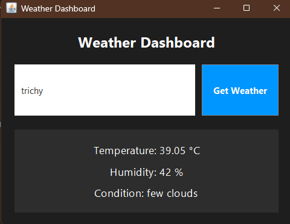
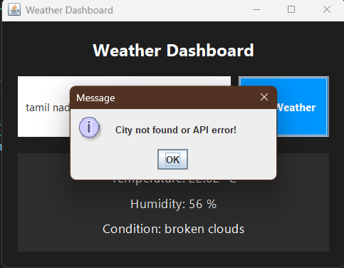

# 🌦️ Weather Dashboard (Java Swing)


A sleek and lightweight **desktop weather application** built using **Java Swing** that fetches real-time weather data using the **OpenWeather API** 🌍.

---

## ✨ Features

🌍 Search weather by city name
🌡️ Live temperature in °C
💧 Humidity tracking
☁️ Weather condition description
🎨 Modern dark-themed UI
⚡ Fast background API calls (multi-threaded)
🚫 Error handling for invalid cities

---

## 🖼️ Preview

```
┌──────────────────────────────────┐
│        🌦️ Weather Dashboard      │
├──────────────────────────────────┤
│  [ Enter City Name ] [ Search ]  │
├──────────────────────────────────┤
│ 🌡️ Temperature: 30 °C            │
│ 💧 Humidity: 65 %                │
│ ☁️ Condition: scattered clouds   │
└──────────────────────────────────┘
```

---

## 🛠️ Tech Stack

🟠 Java (Core)
🎨 Swing & AWT (GUI Design)
🌐 OpenWeather API (Weather Data)
📦 org.json (JSON Parsing)

---

## 📦 Requirements

☑️ Java JDK 8+
☑️ Internet Connection
☑️ `org.json` library

---

## ⚙️ Installation Guide

### 📥 1. Clone the Repository

```bash
git clone https://github.com/ABDUL-RAZEEK-A/Weather-Dashoard.git
cd Weather-Dashoard
```

---

### 📚 2. Add JSON Library

Download and add `org.json` JAR to your project.

Compile with:

```bash
javac -cp .;json-20210307.jar WeatherApp.java
```

---

### ▶️ 3. Run the App

```bash
java WeatherApp
```

---

## 🔑 API Setup

This project uses **OpenWeatherMap API** 🌍

👉 Get your API key here: [https://openweathermap.org/api](https://openweathermap.org/api)

Replace this line in code:

```java
private static final String API_KEY = "YOUR_API_KEY";
```

---

## 📸 Screenshots

### 🏠 Main Dashboard UI


### 🔍 City Search Feature


### 🌡️ Weather Result Display

---

## 🧠 How It Works

1️⃣ User enters city name
2️⃣ App sends request to OpenWeather API 🌐
3️⃣ JSON response is received 📦
4️⃣ Data is parsed using `org.json`
5️⃣ UI updates instantly 🎨

---

## ⚠️ Error Handling

❌ Empty city input
❌ Invalid city name
❌ API failure / network issue

All handled with popup alerts 🚨

---

## 🚀 Future Improvements

🌍 Auto-location detection
📅 5-day forecast support
🌈 Weather icons & animations
🌙 Dark/Light mode toggle
📊 Graph-based weather stats

---

## 🤝 Contributing

💡 Contributions are welcome!

```bash
1. Fork the repo 🍴
2. Create a new branch 🌿
3. Commit changes 💾
4. Open a Pull Request 🔁
```

---

## 👨‍💻 Author

**👤 Abdul Razeek A**
🔗 GitHub: [@ABDUL-RAZEEK-A](https://github.com/ABDUL-RAZEEK-A)

---

## ⭐ Show Your Support

If you like this project:

⭐ Star this repository
🍴 Fork it
📢 Share it

---
